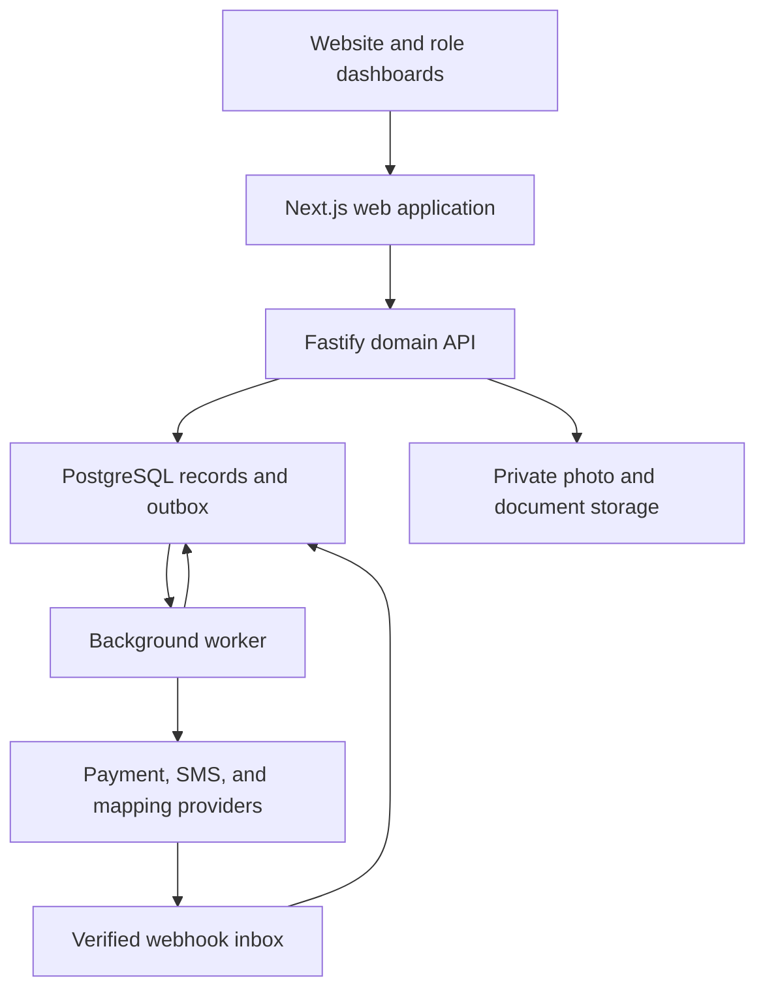

# Reef Window Cleaning — CRM & Service Platform

**Status:** Implementation specification for a production application. The features, repository paths, commands, and tests described here are target contracts; this README does not imply that the application has already been implemented.

**Business:** Reef Window Cleaning  
**Audience:** Engineers, product designers, technical leads, and the Reef owner  
**Primary objective:** Turn one-time window-cleaning customers into repeat customers while running sales, field work, scheduling, billing, and customer communication from one system.

Build a durable first version that Reef can operate and extend. Prioritize accurate records, clear workflows, reliable payments, and access control before adding advanced automation.

## Contents

- [1. Product scope and delivery order](#1-product-scope-and-delivery-order)
- [2. Architecture and technology decisions](#2-architecture-and-technology-decisions)
- [3. Domain model and data integrity](#3-domain-model-and-data-integrity)
- [4. Estimates, jobs, scheduling, and routes](#4-estimates-jobs-scheduling-and-routes)
- [5. Recurring service and customer retention](#5-recurring-service-and-customer-retention)
- [6. Invoices, payments, refunds, and commissions](#6-invoices-payments-refunds-and-commissions)
- [7. Referral accounts and Reef Credit](#7-referral-accounts-and-reef-credit)
- [8. Authentication and authorization](#8-authentication-and-authorization)
- [9. Dashboards, website, and mobile experience](#9-dashboards-website-and-mobile-experience)
- [10. Messaging and automation](#10-messaging-and-automation)
- [11. CEO dashboard and metric definitions](#11-ceo-dashboard-and-metric-definitions)
- [12. API and event contracts](#12-api-and-event-contracts)
- [13. Repository and development setup](#13-repository-and-development-setup)
- [14. Security, operations, backups, and exports](#14-security-operations-backups-and-exports)
- [15. Verification and acceptance criteria](#15-verification-and-acceptance-criteria)
- [16. Implementation milestones](#16-implementation-milestones)
- [17. Configurable business decisions](#17-configurable-business-decisions)
- [18. Engineering references](#18-engineering-references)

## 1. Product scope and delivery order

### Operating principle

Every active customer must have an active service plan or a dated follow-up owned by a staff member. Apply this rule per active property and service group so a plan for one storefront does not hide another property that needs attention. An explicit do-not-contact preference suppresses messages while retaining an internal review date.

### Functional scope

| Priority | Capability | Required outcome |
| --- | --- | --- |
| 1 | CRM and jobs | Leads, customers, contacts, properties, estimates, services, jobs, notes, before-and-after photos, and employee records share one history. |
| 2 | Scheduling and worker routes | Dispatchers assign crews, reserve capacity, publish routes, resolve conflicts, and handle weather changes. Workers use their phones. |
| 3 | Recurring service | Three-month, six-month, annual, commercial weekly, and commercial monthly plans generate service obligations and future follow-ups. |
| 4 | Payments | Invoices, deposits, online payments, saved payment methods, billing after service, refunds, failed payments, and commission accounting. |
| 5 | Customer login | Phone number and one-time text login into a customer portal on the Reef website. |
| 6 | Referral credit | Unique referral links, new-customer discounts, pending rewards, credit balances, expiration, redemption, and an auditable ledger. |
| 7 | Door-to-door sales | Assigned neighborhoods, house-level map pins, every door visit, conversations, estimates, appointments, and salesperson performance. |
| 8 | Automated texts | Event-based messages, scheduled follow-ups, replies, consent, delivery tracking, and operator intervention. |
| 9 | CEO dashboard | Defined company KPIs with drill-downs and filters by date, neighborhood, worker, salesperson, service, and lead source. |
| 10 | Website integration | Services, service area, gallery, reviews, quote requests, booking, plans, referrals, account access, and payment links write directly to the CRM. |

Authentication, audit events, monetary accuracy, backups, and event capture begin with the foundation. OTP delivery and essential appointment/payment messages ship when their dependent features ship; priority 8 expands the automation interface and campaigns.

### Window-cleaning service model

Support separate catalog items for interior windows, exterior windows, screens, tracks, skylights, hard-water removal, and custom work. A storefront route is a scheduling arrangement containing jobs with these services.

Each service has an explicit pricing unit: `window`, `pane`, `screen`, `track`, `skylight`, `hour`, or `flat`. Store what Reef means by a window or pane in the catalog description. Interior and exterior counts are separate quantities unless an explicitly priced package includes both. Do not charge separately for a component already included in a package.

Price books support per-unit rates, custom fixed prices, minimum callout charges, access/height adjustments, and plan discounts. Record quantities, unit prices, duration estimates, tax treatment, inclusions, exclusions, and approved overrides on each estimate line. Use decimal quantities where needed and integer currency minor units for final amounts. Snapshot prices onto accepted estimates, jobs, and invoices; later catalog changes must not rewrite history.

### Initial boundaries

The launch product serves Reef as one business with multiple employees, crews, and territories. Preserve a business identifier in the schema for isolation and future expansion. Full payroll, general-ledger accounting, automatic sales-tax determination, native mobile apps, and unconstrained fleet optimization are later integrations. The product does include hours, commission records, profitability inputs, and exports needed by those integrations.

## 2. Architecture and technology decisions

### Recommended baseline

These are proposed implementation choices. Pin compatible, supported stable releases at project creation; commit the package-manager lockfile and database migration history.

| Layer | Decision | Reason |
| --- | --- | --- |
| Web application | Next.js, React, TypeScript, Tailwind CSS | One responsive web codebase for public pages and role-specific dashboards. |
| Application API | TypeScript and Fastify; REST with OpenAPI | Explicit request validation, stable contracts, and centralized authorization. |
| Data access | Drizzle ORM plus reviewed SQL migrations | Typed queries with direct access to PostgreSQL constraints and extensions. |
| Database | Managed PostgreSQL with PostGIS and `btree_gist` | Transactions, relational integrity, address/territory queries, and reservation constraints. |
| Background work | Separate Node.js worker using BullMQ and managed Redis | Durable coordination for reminders, scheduled work, uploads, and provider calls. PostgreSQL remains the source of truth. |
| Media | Private S3-compatible object storage | Direct uploads, short-lived authorized downloads, lifecycle rules, and versioning. |
| Payments | Stripe initially, behind a payment-provider interface | Hosted payment entry and saved-method support. A Square adapter can replace this choice without redesigning the business model. |
| Messaging | Twilio Messaging and Twilio Verify | Transactional messages, inbound replies, status callbacks, and customer OTP verification. |
| Staff identity | Managed OIDC provider with MFA | Avoid building password storage, password recovery, or staff MFA from scratch. |
| Maps | Mapbox map display, geocoding, and routing adapters | Territory visualization, property pins, and travel estimates. Address inventory is a separate data source. |
| Quality and operations | Vitest, Playwright, OpenTelemetry, structured logs | Domain tests, critical journey tests, tracing, and measurable reliability. |
| Delivery | Containerized web/API/worker, managed data services, infrastructure as code | Reproducible environments and independent scaling of web traffic and background work. |

Use a **modular monolith**: one domain codebase, one transactional database, and separate web/API/worker processes. Modules own their tables and expose application services. Add services only when a measured operational need justifies a boundary.

### System boundaries



Business modules: identity/access, CRM, catalog/estimates, jobs/dispatch, recurring service, billing, referrals, communications, canvassing, workforce, reporting, and public content. Web routes never write directly to domain tables. The worker uses the same application services and validation rules as the API.

### Reliability rules

1. Commit each business change and its outbox event in the same database transaction.
2. A dispatcher publishes committed outbox events to the queue. Publishing and consumption may repeat; consumers must be idempotent.
3. Persist inbound provider events in a webhook inbox before acknowledging delivery. Verify signatures before accepting the event.
4. Keep external network calls outside database transactions. Persist an operation identifier, call the provider, and reconcile the result.
5. Store scheduled obligations in PostgreSQL. Rebuild queue work after Redis loss; Redis is not the only record of a reminder, charge, or service occurrence.
6. Failed work enters a visible retry/dead-letter workflow with an owner, error category, next retry, and safe replay action.
7. Outages must leave recognizable states such as `payment_pending`, `message_unknown`, or `upload_pending`, never a fabricated success.

## 3. Domain model and data integrity

### Core records

All business-owned records carry `organization_id`, stable UUID identifiers, creation/update timestamps, and appropriate actor attribution. Monetary records also carry currency. Keep important queryable values in typed columns; reserve JSON for versioned metadata and provider payloads.

| Records | Essential fields and relationships |
| --- | --- |
| `organizations`, `settings` | Business timezone, currency, service areas, policy versions, invoice numbering, and enabled providers. |
| `users`, `auth_identities`, `memberships`, `sessions`, `login_challenges` | OIDC identity or verified phone subject, business membership, role, active state, hashed session token, challenge consumption, and revocation version. |
| `customers`, `contacts`, `customer_access` | Residential/business account, contact preferences, billing contact, explicit portal access grants, and acquisition source. One account may have multiple authorized contacts. |
| `properties`, `customer_properties` | Normalized address plus unit, coordinates/source/accuracy, residential/commercial type, service timezone, access instructions, window inventory, and effective-dated customer relationship. |
| `leads`, `lead_activities`, `follow_up_tasks` | Prospect/contact, source/campaign, property, assigned salesperson, pipeline stage, next action, owner, and due date. |
| `services`, `price_books`, `price_book_items` | Cleaning category, pricing unit, duration assumptions, checklist template, effective price version, and tax category. |
| `estimates`, `estimate_revisions`, `estimate_lines` | Lead/customer/property, immutable revision, scope, price snapshot, expiration, acceptance evidence, and commercial terms. |
| `jobs`, `job_lines`, `job_checklists`, `job_issues` | Customer/property, accepted scope, lifecycle, completion evidence, assignment, recurrence origin, and exceptions. |
| `appointments`, `resource_reservations` | Job, customer arrival window, internal planned duration, timezone, held/confirmed capacity, resource, and revision. |
| `crews`, `crew_members`, `assignments`, `routes`, `route_stops` | Effective crew membership, job staffing, service date, ordered stops, and published route version. |
| `plan_templates`, `service_plans`, `plan_agreements`, `service_occurrences` | Cadence, property, anchor, signed terms version, service/price snapshot, billing mode, exceptions, and intended service date. |
| `plan_offers`, `plan_events` | Offer outcome, decline reason, pause/skip/cancel history, and future contact task. |
| `invoices`, `invoice_lines`, `credit_notes` | Number, issued snapshots, discounts, taxes, due date, job/line allocations, and adjustments. |
| `payments`, `payment_attempts`, `payment_allocations`, `refunds`, `disputes` | Provider references, monetary amount, state, invoice/deposit allocation, reconciliation state, and reversals. |
| `referral_accounts`, `referral_attributions`, `referral_rewards` | Public code, referring/referred customer, qualification source, policy version, amount, and eligibility status. |
| `credit_lots`, `credit_journals`, `credit_postings`, `credit_reservations` | Grant origin, expiry, balanced bucket transfers, invoice allocation, idempotency key, and reversal links. |
| `notes`, `media_assets`, `media_links`, `reviews` | Owning entity, visibility, photo before/after grouping, upload state, publication consent, and review source/rating/date. |
| `employees`, `time_entries`, `commission_rules`, `commission_entries`, `commission_payouts` | Worker/salesperson profile, approved time, compensation rule snapshot, accrued/reversed amount, and payout reference. |
| `territories`, `territory_assignments`, `door_addresses`, `door_visits` | Neighborhood polygon, assigned salesperson, address/unit pin, visit outcome, conversation, follow-up, and lead/job link. |
| `consents`, `conversations`, `messages`, `message_events`, `automation_runs` | Purpose-specific consent, template version, recipient, provider ID, event history, dedupe key, and reply handling. |
| `campaigns`, `marketing_spend`, `attribution_links` | Source taxonomy, dated spend, attribution model/version, and job/customer allocation. |
| `audit_events`, `outbox_events`, `webhook_events`, `idempotency_records`, `export_jobs` | Actor, correlation, durable event delivery, request fingerprints, replay control, and export evidence. |

`Customer` is the commercial account, `contact` is a person, and `property` is the physical service location. Changing a property owner must not transfer the previous customer's invoices, photos, or portal access. Jobs and invoices retain their original account relationship.

### Enforced invariants

- Use integer minor units for money, explicit currency, and decimal-safe arithmetic for quantities/rates. Never use binary floating-point for invoice or credit calculations. Reject mixed-currency allocations.
- Add composite foreign keys including `organization_id` for business relationships. A valid UUID from another business must never satisfy a relationship.
- A worker reservation cannot overlap another active reservation for that worker. Reserve all crew members and required shared equipment transactionally. Use PostgreSQL range exclusion constraints for confirmed/held resources [R3].
- Ensure at most one job per service occurrence, one referral attribution per referred customer, and one qualifying reward per referred customer and program policy. Use database uniqueness, not just UI checks.
- Give provider events unique `(provider, provider_account_id, event_id)` identities when available. For callbacks without event IDs, use a documented provider-specific fingerprint and idempotent state reduction; one SMS can have multiple distinct status events.
- Financial journals are append-only. Corrections create linked reversals; issued invoices use credit notes and supplemental invoices. Restrict update/delete privileges on finalized records.
- Store UTC instants for events and reservations, plus IANA timezone and local calendar values for schedules. Calendar-month recurrence is not a fixed number of days.
- Use optimistic concurrency (`version`/`If-Match`) for dispatch, estimates, and editable CRM records. A stale write returns `409 Conflict` with a safe recovery path.
- Do not globally enforce phone uniqueness across CRM contacts. Households and businesses can share phones. Enforce uniqueness for the verified authentication subject and grant customer access explicitly.
- Archive operational records with audit history. Handle deletion/retention requests through a controlled workflow that preserves required financial records and removes unneeded personal data.

### Query and indexing strategy

Index tenant/customer foreign keys, lead stage and owner, due follow-ups, appointment time/resource, plan status/next occurrence, invoice state/due date, and provider identifiers. Use spatial indexes for neighborhood containment and map viewport queries. Paginate collections using stable cursors. Add indexes from actual query plans rather than indexing every field.

## 4. Estimates, jobs, scheduling, and routes

### Lead-to-service workflow

1. A website request, phone call, referral, or door visit creates a lead with source attribution and an assigned next action.
2. Staff identify or create the customer and property through a duplicate-review flow. Preserve the original lead and activity history.
3. Build a versioned estimate with cleaning scope, units, duration, adjustments, taxes, optional recurring offer, and expiration.
4. Acceptance records the exact estimate revision, accepted terms, actor, and timestamp. Changes afterward require a new approved revision or change order.
5. Acceptance creates a draft job. Booking separately confirms resource capacity and any required deposit. Repeated acceptance requests return the same resulting job.
6. Dispatch publishes the appointment and worker route. Workers complete the checklist, time entries, notes, and required photos.
7. Completion passes validation, finalizes billing through the selected billing policy, and schedules the next service or follow-up.

### Lifecycle contracts

| Object | States and transition rules |
| --- | --- |
| Lead | `new`, `contacted`, `qualified`, `estimate_sent`, `won`, `lost`, `nurture`. Winning requires a linked confirmed booking; loss/nurture records a reason and appropriate follow-up. |
| Estimate revision | `draft`, `sent`, `accepted`, `declined`, `expired`, `superseded`. Only an unexpired sent revision can be accepted. |
| Job | `draft`, `ready_to_schedule`, `scheduled`, `en_route`, `in_progress`, `completed`, `cancelled`. Issues/blocked work are separately recorded so lifecycle history remains clear. |
| Appointment | `held`, `confirmed`, `in_progress`, `completed`, `cancelled`, `expired`. Rescheduling changes the reservation atomically and preserves revision history. |
| Invoice | `draft`, `open`, `partially_paid`, `paid`, `void`, `uncollectible`. Overdue is derived from due date and outstanding balance; refund/dispute state is separate. |
| Service plan | `draft`, `pending_acceptance`, `active`, `paused`, `cancelled`, `expired`. Skipping affects a service occurrence rather than cancelling the plan. |

Expose authorized commands for transitions rather than a generic endpoint that accepts any status string. Every transition records actor, reason where applicable, and event time.

### Scheduling requirements

- Day/week calendar, unscheduled queue, drag-and-drop reassignment, crew availability, worker leave, service duration, access windows, and travel buffers.
- Distinguish the customer-facing arrival window from the internal resource reservation. A two-hour arrival window does not mean two hours of labor.
- Show availability only for eligible services, service areas, staffing, equipment, and sufficient travel time. Server-side checks are authoritative.
- Online booking uses a short-lived capacity hold. Confirmation acquires locks and validates capacity again; two browsers cannot reserve the same last slot.
- If a deposit arrives after a hold expires, place the booking in an exception queue and reacquire capacity or refund under policy. Never silently displace another appointment.
- Rescheduling acquires the new reservation and releases the old one in one transaction. If the new slot is unavailable, keep the original booking intact.
- Treat holidays, weather postponements, customer no-shows, lockouts, and incomplete service as explicit outcomes. No automatic full-service charge for incomplete work.
- Customer rescheduling follows the configured cutoff and eligible slots. Requests outside policy become staff tasks without altering the confirmed appointment.

### Routes

Publish a dated route with crew, ordered stops, addresses, estimated service/travel times, and a revision. Support storefront route templates with weekly or monthly schedules, fixed stop order, per-location access notes, and skipped stops.

Start with dispatcher ordering and navigation links. Add travel-based ordering as a suggestion that the dispatcher can inspect and accept. Reordering must respect appointment windows and labor capacity; mapping suggestions do not override reservations. Version routes so a worker sees that a published plan changed.

An optimization provider has real stop and constraint limits. Mapbox Optimization v1 currently accepts at most 12 coordinates per request; do not present it as an unlimited multi-crew scheduler [R10]. Larger routes retain manual ordering until a suitable solver/provider is selected and tested.

## 5. Recurring service and customer retention

### Plan contract

Support calendar cadences of every 3 months, 6 months, and 12 months, plus commercial weekly and monthly service. Store cadence unit/interval, anchor date, service timezone, preferred day/window, service quantities, price version, agreement version, payment authorization, start/end dates, and assigned route where applicable.

**Service frequency and billing frequency are different fields.** The initial default is `bill_after_completed_service`. A quarterly cleaning agreement does not automatically create a monthly subscription charge. Commercial accounts may opt into monthly consolidated billing for completed jobs. Fixed subscription charges for access/membership are a separate future product with separate terms.

Plan acceptance records the exact scope, price, cadence, cancellation/rescheduling terms, and card-on-file authorization. Store terms text/version and acceptance evidence. Price changes apply to future work under the accepted change policy; they never alter an issued invoice or completed job.

### Occurrence generation

- Generate occurrences on a rolling planning horizon, proposed at 90 days, and always retain the next due occurrence even when farther away.
- Identify each occurrence by `(organization_id, service_plan_id, occurrence_sequence)`. Derive its original due date from the anchor. A date move must retain the occurrence identity.
- Store intended date, current scheduled appointment, due window, and outcome separately. A future obligation is not a confirmed appointment until capacity is reserved.
- Month-end dates clamp to the last valid day of the target month while retaining the original anchor rule. Test January 31 and February 29 explicitly.
- For ambiguous daylight-saving local times, select the earlier offset; shift nonexistent local times forward by the gap. Persist the resolved instant and show the applied adjustment.
- Rescheduling one visit does not shift all later visits by default. Changing the series requires an explicit effective date and preview of affected future occurrences.
- A nightly reconciliation detects missing occurrences, duplicate jobs, stale pauses, overdue work, and customers without follow-ups.

### Pause, skip, cancel, and resume

| Action | Required behavior |
| --- | --- |
| Pause | Record reason and start/end or review date. Suppress new booking/billing for affected service. Show existing future bookings for explicit cancellation or retention. |
| Skip | Mark one occurrence skipped with a reason; retain subsequent cadence. Release its reservation and prevent service-based billing. |
| Cancel | Record effective date and reason, cancel applicable future occurrences/reservations/reminders, and preserve completed service and outstanding invoices. |
| Resume | Recalculate future obligations once, present the next service date, and avoid a burst of historical make-up jobs or charges. |
| Change scope/price | Create a future-effective plan version and required customer acceptance. Keep prior job snapshots intact. |

The customer portal supports plan visibility and requests for pauses, skips, cancellation, and schedule changes. Automatically apply requests that satisfy policy; otherwise create a visible manager task and show the current status to the customer.

### Plan declines and next cleaning

Record every plan offer, offer date, outcome, decline reason, salesperson, and follow-up date. Completing a one-time job must create or update a follow-up task for the relevant property/service group. An active plan supplies the next service obligation; paused, cancelled, and declined plans require a future review task.

Check this coverage rule when a customer/property becomes active, after job completion, and whenever plan coverage ends. Assign missing follow-ups to a configured staff owner with a dated action; the nightly scan reports unresolved gaps rather than silently treating them as covered.

Derive the next recommended cleaning from the property's last completed service and an explicit recommendation interval. Label recommendations separately from confirmed bookings. An overdue task remains visible until completed or rescheduled with a reason; automation must not keep moving the due date without action.

## 6. Invoices, payments, refunds, and commissions

### Ownership and payment entry

Reef owns invoice numbers, line items, service records, payment allocations, and accounts-receivable state. Stripe owns payment-method vaulting and processor transaction state. Use hosted Checkout or provider-hosted payment fields. Store provider IDs and limited display metadata such as brand/last four digits; never receive or store full card numbers or CVC in Reef databases, logs, or analytics.

Save a payment method through the provider's setup flow and retain customer authorization for the agreed future use. Off-session payments can require customer action; create a secure recovery link and staff task rather than assuming a saved card will always work [R4].

Implement one payment adapter initially. Its contract covers customer mapping, checkout, method setup, charge attempt, refund, status lookup, and verified webhook normalization. Do not implement both Stripe and Square unless the business needs both. Changing providers requires a migration plan for saved methods; tokens are provider-specific.

### Invoice arithmetic

Use this proposed invoice policy consistently:

```text
service_subtotal = sum(rounded line quantity × unit price)
discount_total = approved discounts, including applied promotional Reef Credit
net_service_amount = service_subtotal - discount_total
invoice_total = net_service_amount + tax_amount
adjusted_total = invoice_total - issued_credit_notes
amount_due = adjusted_total - net_payment_allocations
```

`net_payment_allocations` means successful allocations less allocation reversals. It includes deposits applied to this invoice. A failed or pending payment contributes zero. A negative result is an unapplied customer credit/refund obligation, not a negative payment request.

Use decimal arithmetic and document rounding per line, currency, and tax rule. Allocate invoice-wide discounts and tax to job/service lines so reporting reconciles. Reef Credit is a promotional discount in this design, not cash tender or revenue; its treatment in the tax base must be configured to the approved local policy. Never assume window cleaning is universally taxable or exempt.

Issued invoices are immutable snapshots. Use credit notes for reductions and supplemental invoices for additions. A service refund normally includes the corresponding credit note, so returning cash does not accidentally recreate an overdue balance. Overpayment refunds reverse only the unapplied/overpaid allocation.

### Collection workflow

1. Validate the accepted scope and completion state. Produce one invoice per job by default, or explicit monthly commercial consolidation with line-to-job allocation.
2. Apply eligible discounts and reserved Reef Credit, calculate tax, then allocate any deposit. Finalize the invoice snapshot and consume the associated credit reservation atomically.
3. If the amount due is zero, mark the invoice settled with its actual funding breakdown and do not create a zero-value processor charge.
4. For an authorized saved card, create a persisted collection operation for the invoice version and amount. Use a stable provider idempotency key and one active collection operation per balance.
5. Otherwise create a hosted checkout/payment link for that same collection operation. Do not race an off-session charge against a live customer checkout.
6. Treat the browser's return URL as navigation only. A verified webhook or authenticated reconciliation lookup establishes processor success.
7. In one transaction, record the successful payment, allocate it, update the invoice balance, and emit receipt/referral/commission events.

Use the same idempotency key after a timeout with an unknown result. Stripe's key retention is finite, so retain Reef's operation record and reconcile before any late retry; provider keys alone are not permanent deduplication [R5]. A new key represents an explicitly authorized new attempt, not uncertainty about an old one.

Invoice adjustments or new credit redemptions invalidate prior checkout amounts. Lock the invoice's collection state, cancel/expire live collection sessions when supported, and reconcile in-flight attempts before starting another one. Route unresolved races or overpayments to an exception workflow.

### Deposits and failed payments

Store a deposit as a successful payment linked to the booking with an unapplied balance until allocated to the final invoice. Show deposits in cash reporting when received and recognize completed-service revenue independently. A cancelled booking applies the approved refund/cancellation policy; do not silently convert a deposit into earned service revenue.

Track attempts as `created`, `processing`, `requires_action`, `succeeded`, `failed`, or `cancelled`. Failure classifications distinguish authentication, expired method, insufficient funds, provider outage, and unknown result. Use bounded retries and a configured dunning schedule. A customer can replace their saved method through the hosted setup flow. Staff can stop retries and suspend future service under policy.

### Webhooks, refunds, and reconciliation

Verify Stripe signatures using the original raw request body, persist the event, and return success after durable acceptance. Process asynchronously and tolerate repeated or out-of-order deliveries [R6]. Resolve conflicting state against the current provider object. Prevent duplicate domain effects even when different provider events describe the same underlying payment.

Refunds require permission, reason, original payment, and an idempotent operation. Enforce a concurrency-safe refundable limit after prior and pending refunds. Full and partial refunds create their financial allocations, invoice adjustments when appropriate, referral reevaluation, and commission reversals. Cash refunds never exceed processor-paid cash; promotional credit restoration is a separate ledger operation.

Track disputes and chargebacks separately from voluntary refunds. Daily reconciliation compares provider transactions/refunds/disputes with Reef records, checks invoice allocations, and reports missing or mismatched entries. Bank payouts and processor fees have their own reconciliation view; they are not the same metric as customer cash collected.

### Employee and salesperson commissions

Support hourly time, fixed-per-job compensation, and percentage commission rules. Version rules and snapshot the recipient, basis, rate, source job, and split at assignment/approval time. Proposed commission basis: collected service proceeds after discounts, excluding tax, tips, and refunded amounts, and only after service completion. Deposits alone do not earn commission.

Allocate shared sales/worker splits explicitly and prohibit accidental duplicate credit. Use append-only accrual, adjustment, reversal, and payout records. Workers and salespeople see their own pending/earned/paid amounts. Approved payout batches can be exported to payroll; recording a payout does not transfer money. Refund reversals after payout create a manager-reviewed adjustment, not an automatic wage deduction.

## 7. Referral accounts and Reef Credit

### Program behavior

Every customer receives an opaque, unique referral code and link, for example the relative route `/r/REEF-EXAMPLE`. Do not encode the customer's database ID, phone number, or name in the public code.

Capture the code on lead creation or before booking confirmation, record the attribution source/time, and preserve it through conversion. Apply one program attribution per referred customer. Staff corrections require audit history; rewards already granted require reversal/regrant rather than editing the original attribution.

Proposed qualification rule: the referred customer's first eligible job is completed and its invoice is fully paid with a positive qualifying cash payment. A booking/deposit creates a pending reward. Completion plus payment releases it. This is a configurable business choice; Reef must select the production reward amount, new-customer discount, minimum eligible spend, expiry, and any qualification waiting period.

Configure $25 or $50 as policy values rather than constants embedded in code. A new-customer discount is an invoice adjustment for the referred customer, independent from the referring customer's earned credit.

### Ledger design

Maintain an append-only, balanced credit journal. Each journal has two or more signed postings whose sum is zero for a currency. Postings transfer credit between named buckets; this is a promotional-credit subledger, not Reef's full accounting general ledger.

| Event | Transfer | Meaning |
| --- | --- | --- |
| Pending reward | Program control → pending | Referral recorded; amount is not spendable. |
| Qualification | Pending → available | Qualification passed; create/activate a credit lot with expiry. |
| Reservation | Available → reserved | Temporarily hold credit for a specific invoice draft. |
| Finalized redemption | Reserved → redeemed | Apply the invoice discount exactly once. |
| Reservation release | Reserved → available, or expired | Checkout/draft hold ends; original expiry still applies. |
| Expiration | Available → expired | Expire remaining eligible units from a specific lot. |
| Reward reversal | Pending/available → revoked | Qualification was invalidated; preserve the original grant history. |
| Redemption reversal | Redeemed → available, or expired | Restore credit under the original lot/expiry when an invoice adjustment permits it. |

The program control bucket can carry the balancing negative amount. Customer buckets remain nonnegative. Derive available, reserved, pending, earned, redeemed, expired, and reversed totals from postings; any stored balance is a rebuildable projection.

Each journal records customer, currency, lot, amount, source entity, policy version, effective time, actor, idempotency key, and reversal reference. Enforce balancing inside one database transaction using a journal-posting operation and a deferred constraint trigger or equivalent database enforcement. Do not expose direct posting writes.

### Redemption and failure rules

- Lock the customer's eligible lots and invoice draft when reserving credit. Two simultaneous checkouts cannot spend the same credit.
- Allocate earliest-expiring eligible credit first and retain lot-level allocations. Limit redemption to the permitted service subtotal and policy cap; credit cannot create cash change.
- Set reservation expiry to the earlier of the checkout hold deadline and lot expiry. Finalization must revalidate it under lock. After finalization the credit is consumed even if remaining cash collection fails; voiding/crediting the invoice determines restoration.
- A voided unpaid invoice restores redeemed credit under the original expiration policy. Partial service refunds restore only credit allocated to refunded service lines. Never restore the same credit through both a void and a refund.
- A full refund of the qualifying referred job invalidates the reward. Partial refunds re-evaluate the original minimum-spend/eligibility rule against the retained qualifying amount.
- Revoke unspent invalid rewards. For reserved credit, invalidate the affected draft/checkout and release then revoke the reservation under the same locks used by finalization. If the credit was already redeemed, record a recovery case and freeze further redemption when policy requires review. Do not create a negative spendable wallet or charge the customer automatically.
- Reject self-referrals and duplicate rewards. Flag shared household/contact/payment indicators for review; a shared IP alone is not sufficient proof of abuse.
- Customer history exposes referral status and credit activity without revealing another customer's address, invoice amount, or payment details.

### Example

Customer A refers Customer B. A's policy promises $25 after B's first completed, paid qualifying service. B receives a separately configured introductory discount. A sees $25 pending, then $25 available when qualification succeeds. On A's next $200 pre-tax service, $25 is reserved and redeemed, reducing the pre-tax amount to $175 under this example's discount policy. The ledger retains every transfer; nobody manually overwrites a balance.

## 8. Authentication and authorization

### Customer phone login

1. Normalize the supplied phone to E.164 and validate the country/format. Return a neutral response that does not reveal whether the customer exists.
2. Send and verify codes through Twilio Verify. Apply request limits by phone, IP, session, and business, with resend cooldowns and a maximum attempt budget. Use provider validity limits rather than inventing an incompatible OTP timeout [R7].
3. On approved verification, consume the local login challenge once and create a revocable, opaque application session. Store only a hash of the session token; use `Secure`, `HttpOnly`, `SameSite` cookies and CSRF protection.
4. Resolve explicit `customer_access` grants for that verified identity. A phone number on a lead/contact is not itself an access grant.
5. For existing imported accounts, provide a staff-assisted claim/recovery process before exposing history. Verify changed phone numbers, revoke old sessions as appropriate, and audit access changes.

Shared household contacts use one verified identity with explicit access to permitted accounts or separately verified contacts. Do not auto-merge CRM accounts because their phone numbers match. Handle recycled/lost numbers with recovery review and require recent verification for sensitive changes.

### Staff login and scope

Workers, salespeople, managers, and the owner use individual staff identities, never shared passwords. Require MFA for the owner/managers and sensitive financial actions; support MFA for all staff. Offboarding revokes identity access, application sessions, territory/crew assignments, and device sync permissions immediately.

Permissions are server-side capability checks plus record scope. UI visibility alone is insufficient. The owner has all business capabilities within Reef, including exports, policies, workforce, and reporting. No dashboard exposes raw processor or authentication secrets.

| Capability | CEO/admin | Manager | Salesperson | Worker | Customer |
| --- | --- | --- | --- | --- | --- |
| CRM records | All | All operational | Assigned leads/prospects and limited linked account data | Minimum assigned-job contact/property data | Explicitly authorized own account data |
| Estimates/prices | All | Manage | Create within price/discount limits | View assigned service scope | View/accept own issued estimate |
| Scheduling/routes | All | Dispatch | Book permitted slots for own prospects | View assigned route; update own execution | Own eligible bookings/change requests |
| Jobs/notes/photos | All | Manage/publish | Own sales activity and permitted job status | Assigned job checklist, notes, uploads, issues, completion | Own published customer-visible content |
| Invoices/payments | All | Issue/collect within grants | Send scoped approved payment link; limited paid/unpaid status | No financial access by default | Own invoices and hosted payment actions |
| Refunds/credit adjustments | All | Only explicitly delegated limits | None | None | Request only |
| Recurring plans | All | Manage | Offer approved plans | View assigned scope | Own plan and permitted requests |
| Territories/canvassing | All | Assign/manage | Assigned territories and own visits | None | None |
| Hours/commissions | All | Approve/manage within grants | Own commissions | Own hours/commissions | None |
| Company KPIs/export/settings | All | Scoped reports/export; no owner-only settings | Own performance | Own productivity | Own account export only |

Use organization-level PostgreSQL row security as defense in depth. Runtime database roles must not own tables or have `BYPASSRLS`; set business context transaction-locally and fail closed when absent [R2]. Application policies additionally enforce customer, assignment, field visibility, and capability scope. Queue handlers and exports follow the same scope rules. Test policies using the actual runtime database role.

## 9. Dashboards, website, and mobile experience

### Branding and usability

Use the supplied `REEF WINDOW LOGO(1).png` as the source brand asset. At implementation, add a web-optimized copy at `apps/web/public/brand/reef-logo.png`, retain the source, and preserve its aspect ratio. Follow its navy, light blue, and white palette; validate contrast for text and controls. No exact color values are assumed from this README.

Design for phone use first: large tap targets, readable forms, sticky primary actions, camera uploads, click-to-call, clear loading/retry states, and usable day routes in sunlight. Target WCAG 2.2 AA with keyboard support, labeled inputs, visible focus, and status text/icons in addition to colors. Dense desktop tables need practical mobile card views.

### Customer portal

Provide upcoming appointments and arrival windows, service history, previous invoices, payment/deposit/refund history, published before-and-after photos, next recommended cleaning, current plan, scheduling/rescheduling, saved-method management through the provider, referral link/code, available/reserved/pending credit, expiration, and referral history.

Use clear distinctions between a request, held slot, confirmed appointment, and recommended date. Include downloadable invoices/receipts and a way to report a service issue. All history is restricted to accounts explicitly granted to that identity.

### Worker mobile dashboard

The home screen shows today's published route and assigned jobs. A job screen includes address/navigation, authorized contact details, access instructions, service quantities, checklist, photos, notes, issues, and time/commission views.

Workers can start travel, mark arrival, complete checklist items, record time, upload categorized before/after photos, add notes, report access/safety/service problems, and complete work. Completion validates mandatory checklist items, time consistency, required successfully uploaded photos, and unresolved blocking issues. A manager override requires a reason and audit event.

Support interrupted uploads and connection loss with persistent local drafts and visible sync status. Queue only allowed field actions using client-generated operation IDs. Revalidate authorization and assignment on sync. Conflicts require review; never silently overwrite a newer schedule. Do not claim full offline operation: booking, payments, customer lookup, and final completion confirmation require server acknowledgment. Limit cached personal data and clear it on logout/expiry.

Track time with start/stop entries, breaks, manual correction reasons, and manager approval. No overlapping active timer per employee. Preserve an edit history and distinguish field labor, travel, and unpaid breaks.

### Salesperson canvassing dashboard

Provide an interactive map with assigned neighborhood polygons, address/unit pins, current outcomes, activity history, and daily/weekly goals. Required visit outcomes include `no_answer`, `interested`, `follow_up_needed`, `estimate_given`, and `booked`; also support `not_interested` and `do_not_knock`.

Every knock is an append-only visit event with address, salesperson, timestamp, outcome, conversation flag/notes, and optional appointment/estimate/lead links. The pin's current display is a projection of history. Revisiting a door adds activity rather than erasing the previous visit. `booked` requires a real linked confirmed appointment.

Expose conversations, appointments, estimates, close rate, attributed booked value, earned revenue, and daily/weekly performance separately. Customer phone/email and notes appear only when appropriate to that salesperson's assignment. Use explicit assignment and attribution rules when territories or leads change hands.

**House-level data is a required input, not an automatic feature of map tiles.** Import a permitted address/parcel inventory with stable source IDs, or create addresses through reviewed field entry. Preserve unit numbers and data provenance. Persistent geocoding requires a storage-permitted provider mode; Mapbox distinguishes temporary and permanent results [R9]. Query pins by viewport, cluster at low zoom, and avoid loading an entire city into the browser.

### Public website integration

Required pages: services, service area, before/after gallery, reviews, quote request, online booking, service plans, referral-credit explanation, customer login/dashboard, and scoped payment links. Use truthful content approved by Reef; do not fabricate testimonials, coverage areas, prices, or ratings.

Quote forms create CRM leads directly through the domain API, including service request, property details, referral code, acquisition source, campaign parameters, and consent evidence. Avoid duplicate submissions using an idempotency token. Use bot protection, rate limits, field validation, and a neutral confirmation.

Self-booking is limited to service scopes Reef can price and time reliably. Complex/custom work offers an estimate appointment or quote request. The same capacity rules and customer records serve both public booking and staff dispatch.

Public galleries require publication permission distinct from sharing a photo with its customer. Remove location metadata and exclude sensitive access details. Review records store source, rating, timestamp, verified association when available, and publication state. Request reviews consistently after eligible jobs; do not restrict requests to customers predicted to leave positive feedback.

## 10. Messaging and automation

### Required triggers

Timings below are suggested configuration defaults, not active campaigns.

| Message | Trigger / eligibility | Cancellation or suppression |
| --- | --- | --- |
| New-lead response | Accepted lead submission | Duplicate lead event or missing permitted channel |
| Estimate follow-up | Unaccepted estimate; proposed +2 and +7 days | Accepted/declined/expired estimate, reply, opt-out |
| Appointment confirmation | Booking committed | Cancelled or superseded appointment revision |
| Appointment reminder | Proposed 24 hours before arrival | Cancelled/rescheduled job; superseded reminder |
| On the way | Assigned worker explicitly starts travel | Already sent for this travel event; stale route |
| Job completion | Completion accepted by server | Completion under review or cancelled event |
| Payment receipt | Confirmed successful payment/allocation | Duplicate provider event |
| Review request | Eligible completed job; proposed +1 day | Already requested under frequency policy |
| Recurring-service reminder | Upcoming due occurrence | Paused/cancelled/skipped occurrence |
| Referral-credit notification | Pending, available, redeemed, or nearing expiry | Duplicate journal/notification event |
| Failed-payment message | Actionable failed collection attempt | Paid, reversed, or superseded attempt |
| Old-customer follow-up | Due follow-up task with no active plan | New plan/booking, reply, opt-out, suppression |
| Declined-plan follow-up | Dated task from plan decline | Subsequent enrollment, reply, or suppression |

Store template versions, allowed variables, business purpose, recipient timezone, trigger source, expected entity version, and rule version. Before sending, re-read current state, permission to contact, suppression, quiet hours, and frequency caps. Cancel stale queued reminders when schedules change. Inbound replies pause relevant sequences and create or update a staff-owned conversation task.

Maintain separate consent for transactional communication and marketing. Store capture method, wording/version, purpose, timestamp, and withdrawal. Implement STOP/HELP and provider suppression behavior. Complete the appropriate sender registration before production. Treat OTP messages separately from marketing enrollment; use the provider-supported recovery path when delivery is blocked.

### Delivery and engagement states

Store the provider's raw event history plus normalized states: `queued`, `sending`, `sent`, `delivered`, `undelivered`, `failed`, `cancelled`, and `unknown`. Derive state using provider-specific transitions so a late callback cannot incorrectly revert a delivered message to sent.

**Standard SMS does not provide an opened/read event.** Display opened as unavailable for SMS. Delivery is not proof of reading. Track inbound replies as separate conversation events and tracked-link clicks as separate engagement events, recognizing that automated scanners may click links. Populate `read_at` only for channels with an actual supported read callback, such as supported RCS/WhatsApp flows [R8].

Use unique automation keys such as `(rule_version, recipient, source_event_id, scheduled_revision)`. On an ambiguous send timeout, record an unknown outcome and reconcile; blind retries can send duplicates when a provider lacks idempotent message creation. Alert staff on persistent failures and maintain a human inbox for replies.

## 11. CEO dashboard and metric definitions

All KPIs must drill down to contributing records and export the same filtered dataset. Store source events from the first release, even if charts arrive later. Display currency, business timezone, date basis, attribution model, last refresh, and incomplete-data warnings.

Default date filters use half-open business-local ranges converted to UTC. Provide comparison periods. Employee means service worker unless the user chooses the separate salesperson filter. Store lead source/campaign and salesperson attribution snapshots so historical results do not change silently when assignments change.

| KPI | Definition / date basis |
| --- | --- |
| Total leads | Distinct leads created in the period, excluding audited duplicates/test data. |
| Doors knocked | Valid deduplicated door-visit events in the period; show distinct addresses separately. |
| Conversations | Door visits explicitly marked as a conversation, counted by visit time. |
| Estimates | Distinct estimates first sent in the period; revisions do not increase the count. |
| Estimate close rate | Accepted estimates from the first-sent cohort ÷ estimates in that cohort, as of the report timestamp. Show still-open count and cohort age. |
| Jobs booked | Distinct jobs whose first confirmed booking occurred in the period; show later cancellations separately. |
| Booked value | Accepted net service value of those booked jobs; distinct from earned revenue. |
| Revenue | Net service-line value for completed work, after discounts and service adjustments, excluding tax. Use completion date; label this the operational revenue view. |
| Cash collected | Successful cash payments received in the period less cash refunds/chargebacks in the period. Show gross receipts and deductions; include deposits and tax explicitly. Exclude promotional credit. |
| Average job value | Net completed-service revenue ÷ completed billable jobs in the period; exclude cancelled work. |
| Recurring revenue earned | Completed-service revenue from jobs linked to a service plan in the period. |
| Expected monthly plan value | Active unpaused plan value normalized by cadence: quarterly price/3, semiannual/6, annual/12, monthly price, weekly price × 52/12. Label as a forecast, not guaranteed or collected revenue. |
| Recurring customers | Distinct customers with at least one active unpaused plan as of the selected date. |
| Service-plan conversion | Customers in the eligible completed-job cohort who activate their first plan within 30 days ÷ eligible customers in that cohort; show immature cohorts separately. |
| Customer retention | For customers whose next service was due in the cohort period, percentage completing eligible repeat service by due date +30 days. Exclude immature cohorts; show plan continuation/cancellation separately. |
| Referral revenue | Completed-service revenue allocated to the referral acquisition source under the selected attribution policy. |
| Referral credits owed | Unexpired available plus reserved credit as of the date; show pending, redeemed, expired, and revoked separately. This is the operational promotional-credit obligation. |
| Worker productivity | Completed assigned jobs and allocated service revenue per approved field labor hour; show travel and rework separately. Avoid crediting the full job value to every crew member. |
| Salesperson performance | Assigned/attributed visits, conversations, estimates, bookings, cohort close rate, booked value, collected proceeds, and commissions. |
| Job profitability | Net service revenue less approved labor cost, accrued commissions, materials, allocated travel, and processor fees; show missing costs and margin percentage. Count each compensation cost once. |
| Marketing performance | Leads, customers acquired, attributed revenue, spend, cost/lead, acquisition cost, and revenue/spend by campaign. Missing spend produces unavailable ratios, not zero-cost acquisition. |
| Reviews | Review count, average rating, and request-to-review conversion only where a review is reliably linked to a request; use review date. |
| Customer acquisition source | First recorded acquisition source distribution, with separately preserved campaign and referral attribution. Include an explicit unknown category. |

Filtering by neighborhood uses the stored territory/address association relevant to the reported event. Service-type filters aggregate eligible line items. Worker and salesperson filters use explicit allocations; company totals count each job/payment once. Require allocation weights to sum to 100% where an amount is split. Payments spanning invoices or service lines must be allocated before dimensional cash reporting.

For ratio metrics with a zero denominator, show `N/A`. Never average percentages across groups; aggregate numerators and denominators. A single ambiguous “close rate” card is insufficient: label estimate, lead, or door-conversation conversion and its cohort.

The operational revenue view restates a job's completion-period value when a later service adjustment applies. Show the adjustment's posting date and a reconciliation view so it can be compared with cash-period activity and external accounting reports. Do not present this operational dashboard as a statutory accounting ledger.

Start with indexed SQL queries and incremental reporting projections. Target refresh within five minutes, expose lag, and rebuild projections from authoritative records. Historical money and as-of balances require effective-dated adjustments; current row status alone cannot reconstruct past reports.

## 12. API and event contracts

Publish an OpenAPI contract and generate the typed web client. Prefix application routes with `/api/v1`. Validate input at the boundary and enforce business rules inside domain services. IDs supplied by the client never establish authorization or ownership.

Representative target endpoints:

| Method and route | Purpose / access |
| --- | --- |
| `POST /public/leads` | Rate-limited quote/referral intake with server-resolved business context. |
| `POST /auth/customer/challenges` | Request neutral-response OTP challenge. |
| `POST /auth/customer/sessions` | Verify challenge and issue session. |
| `GET /me/appointments` | Authorized customer's appointments only. |
| `POST /customers`, `POST /properties`, `POST /leads` | Scoped staff CRM operations. |
| `POST /estimates/{id}/revisions` | Create immutable pricing/scope revision. |
| `POST /estimates/{id}/accept` | Accept a particular revision with acceptance evidence. |
| `GET /availability`, `POST /booking-holds` | Query candidate slots and reserve limited capacity. |
| `POST /jobs/{id}/book`, `POST /jobs/{id}/reschedule` | Confirm or change booking transactionally. |
| `POST /jobs/{id}/complete` | Authorized completion command with required evidence. |
| `POST /media/upload-intents`, `POST /media/{id}/finalize` | Authorize upload and verify/scanning workflow. |
| `POST /plans/{id}/pause`, `/resume`, `/cancel` | Explicit plan commands with effective dates. |
| `POST /occurrences/{id}/skip` | Skip a single planned service. |
| `POST /invoices/{id}/checkout`, `POST /payment-method-setups` | Server-priced hosted payment/setup operations. |
| `POST /payments/{id}/refunds` | Permission-checked refund request. |
| `GET /me/referrals`, `POST /invoices/{id}/credit-reservations` | Own credit history and bounded redemption. |
| `GET /territories/{id}/doors`, `POST /door-visits` | Scoped map data and idempotent visit capture. |
| `GET /reports/kpis`, `POST /exports` | Authorized, filter-consistent reporting/export. |
| `POST /webhooks/stripe`, `/webhooks/twilio/status`, `/webhooks/twilio/inbound` | Signature-verified provider ingestion; separate from browser session authentication. |

Require `Idempotency-Key` for acceptance, booking, completion, collection, refunds, credit operations, and offline-synced visits/time events. Scope it by business, authenticated principal, and operation. Persist a request-body fingerprint and resulting status/response. Reusing a key with a different body returns a conflict. Retain durable domain uniqueness even after request-cache expiration.

Use `400` for malformed input, `401` for absent authentication, `403` for denied capabilities, `404` for inaccessible scoped resources, `409` for stale/conflicting actions, `422` for domain validation, and `429` for throttling. Return structured errors with a stable code and correlation ID, excluding sensitive detail.

```json
{
  "error": {
    "code": "SCHEDULE_CONFLICT",
    "message": "That appointment time is no longer available.",
    "requestId": "example-request-id",
    "retryable": false
  }
}
```

Every event carries `event_id`, `event_type`, `schema_version`, `organization_id`, `aggregate_id`, `aggregate_version`, `occurred_at`, and `correlation_id`. Payloads reference records and include only data needed by consumers. Initial events include `lead.created`, `estimate.accepted`, `appointment.confirmed`, `appointment.rescheduled`, `job.completed`, `invoice.issued`, `payment.succeeded`, `payment.failed`, `refund.succeeded`, `plan.changed`, `referral.qualified`, `credit.posted`, and `message.received`.

Events describe committed facts. Consumers re-check current eligibility before side effects. Schema changes remain compatible with replay, and event history contains enough references to rebuild reporting and detect missing work.

## 13. Repository and development setup

### Target repository layout

| Path | Responsibility |
| --- | --- |
| `apps/web/` | Public site, portal, worker, sales, manager, and CEO interfaces. |
| `apps/api/` | HTTP endpoints, request validation, sessions, and webhook ingestion. |
| `apps/worker/` | Outbox dispatch, scheduled work, reconciliation, notifications, and media processing. |
| `packages/domain/` | Business modules, state transitions, pricing, policies, and application services. |
| `packages/db/` | Schema, reviewed migrations, scoped repositories, and synthetic seed data. |
| `packages/contracts/` | OpenAPI definitions, event schemas, and generated client contracts. |
| `packages/integrations/` | Stripe, Twilio, maps, identity, and object-storage adapters. |
| `packages/ui/` | Accessible components, Reef brand tokens, forms, and tables. |
| `packages/config/` | Validated environment loading and shared nonsecret configuration. |
| `tests/` | Cross-module integration, authorization, concurrency, and end-to-end scenarios. |
| `infra/` | Deployment definitions, local services, backups, monitoring, and infrastructure code. |
| `docs/adr/`, `docs/runbooks/` | Architecture decisions and operational recovery procedures. |

Maintain separate development, staging, and production accounts/resources. Staff role creation is an audited bootstrap/admin operation. Public registration can never select a staff role.

### Target local workflow

The scaffold must provide the files and scripts below. These commands are the intended onboarding contract and will work only after that scaffold exists.

Prerequisites: a compatible supported Node.js LTS release, the pinned pnpm version, Docker with Compose, and sandbox provider accounts when exercising real integrations.

```bash
pnpm install --frozen-lockfile
cp .env.example .env.local
docker compose up -d postgres redis minio
pnpm db:migrate
pnpm db:seed
pnpm dev
```

The root Compose file should expose PostgreSQL with required extensions, Redis, and local S3-compatible storage. `pnpm dev` must start web, API, and worker with one validated development configuration. Seed only synthetic customers/properties and explicitly labeled test roles; never ship reusable production passwords.

```bash
pnpm lint
pnpm typecheck
pnpm test
pnpm test:integration
pnpm test:e2e
pnpm build
```

Each script has a documented purpose. Integration tests use real isolated PostgreSQL/Redis instances; browser tests exercise the full stack. Provider adapters support deterministic local fakes and separate sandbox contract tests. A fake must never be available in production configuration.

### Configuration contract

| Variables / configuration | Handling |
| --- | --- |
| `APP_ENV`, `APP_ORIGIN`, `API_ORIGIN` | Validate allowed origins and environment; never construct security links from an untrusted Host header. |
| `DATABASE_URL`, `REDIS_URL` | Private credentials; require secure production connections. Separate migration and runtime DB roles. |
| `OIDC_ISSUER`, `OIDC_CLIENT_ID`, `OIDC_CLIENT_SECRET` | Staff identity provider; validate issuer/audience and use authorization code flow with PKCE/state/nonce. |
| `SESSION_SECRET`, `FIELD_ENCRYPTION_KEY_ID` | Secret manager/key management references; support rotation. |
| `STRIPE_SECRET_KEY`, `STRIPE_WEBHOOK_SECRET` | Server-only payment and webhook credentials; separate test/live environments. |
| `TWILIO_ACCOUNT_SID`, `TWILIO_API_KEY`, `TWILIO_API_SECRET`, `TWILIO_AUTH_TOKEN` | Server-only credentials; use the appropriate auth token for SDK webhook validation. |
| `TWILIO_VERIFY_SERVICE_SID`, `TWILIO_MESSAGING_SERVICE_SID` | Separate verification and application messaging configuration. |
| `S3_ENDPOINT`, `S3_REGION`, `S3_BUCKET` | Private media configuration; prefer workload identity over static production access keys. |
| `MAPBOX_SERVER_TOKEN`, `NEXT_PUBLIC_MAPBOX_TOKEN` | Separate scoped tokens; the browser token is intentionally public and must have URL restrictions. |
| `OTEL_EXPORTER_OTLP_ENDPOINT`, error-monitoring configuration | Redact personal data and credentials before export. |
| Business timezone, currency, reward policy, price book, tax policy | Versioned database settings editable by permitted staff; not scattered environment constants. |

Load `.env.local` consistently for local API/worker/web development. Production reads injected environment/secret references. Commit only placeholder examples. Never prefix a secret with `NEXT_PUBLIC_` or serialize it into client props, logs, build artifacts, or source maps.

## 14. Security, operations, backups, and exports

### Security baseline

- Enforce TLS, secure sessions, CSRF protection, restrictive CORS, a tested content-security policy, parameterized queries, output escaping, and input limits.
- Rate-limit authentication, lead intake, booking holds, exports, and expensive map queries. Monitor OTP abuse and provider spending.
- Classify notes as `internal`, `crew`, or `customer_visible`. Workers cannot publish internal manager notes. Encrypt sensitive access codes and redact them from logs/exports without an explicit operational need.
- Authorize every photo upload/download against the current job/customer scope. Restrict MIME signatures, size, count, and dimensions; quarantine and scan uploads, remove EXIF location, and create display derivatives. Reject arbitrary remote import URLs unless an SSRF-safe importer exists.
- Keep media private by default. Use short-lived signed URLs and random object keys. URLs are temporary credentials, not permanent public attachment addresses.
- Audit role changes, record merges, schedule changes, estimate overrides, plan agreements, refunds, credit adjustments, financial exports, and session recovery. Store actor, timestamp, target, reason, and safe before/after details.
- Scan dependencies and secrets in CI. Keep staging free of production personal data unless a controlled anonymization process has been applied.

### Deployment and observability

Run web/API/worker with health checks, graceful shutdown, and bounded concurrency. Deploy migrations once through a controlled job. Use backward-compatible expand/migrate/contract changes so the previous release remains usable during rollout. Never execute destructive migrations automatically at application startup.

Use structured logs, correlation IDs, traces, and dashboards for request errors/latency, database health, queue lag, outbox age, webhook failures, payment reconciliation gaps, OTP failure rates, message failures, missed occurrences, backup age, and export failures. Alert on money mismatches and access-control anomalies, not only server crashes.

Proposed initial service objectives, to validate in staging:

| Measure | Target |
| --- | --- |
| Application availability | 99.9% monthly for critical workflows, with provider degradation reported separately. |
| Normal API latency | p95 below 500 ms for ordinary reads and 1 second for database-only writes under agreed load. |
| Background processing | p95 committed-event pickup within 60 seconds under normal load. |
| KPI freshness | Under five minutes, with visible actual lag. |
| Recovery point objective | At most 15 minutes of database data loss. |
| Recovery time objective | Restore core service within four hours. |

These are engineering targets, not a statement of achieved performance. Load-test realistic staff/customer concurrency and at least 10× Reef's initial expected record volume. Track photo storage, SMS segments, OTP traffic, geocoding, database growth, and queue costs.

### Backups and restoration

Configure automated encrypted daily database backups and continuous point-in-time recovery with a proposed 35-day retention. Enable object versioning/backups for photos and agreements. Keep backup access separate from runtime access, monitor failures, and protect deletion permissions.

Run a restoration drill before launch and at least quarterly. Restore database and media references into an isolated environment with outbound texts and payments disabled. Verify record counts, financial/credit invariants, attachment checksums, identity configuration, and recovery time. Rebuild queue work and reporting projections from database records. Document who can restore, where encryption keys are recovered, and how provider state is reconciled before restarting side effects.

### Complete data export

Admin exports must include customers/contacts, properties, leads/activity, estimates/revisions, jobs, appointments/routes, plans/agreements, invoices/adjustments, payments/refunds, credits/journals, notes/photos, reviews, messages/consent, door visits, workforce/commissions, settings, and audit history within retention policy.

Provide CSV for human use and versioned JSON plus original media/document files for portability. Include a manifest with schema version, field dictionary, UTC export timestamp, stable IDs/relationships, file paths, counts, and checksums. Escape spreadsheet formula prefixes in CSV output. Exclude raw card information, secrets, active sessions, and OTPs.

Produce exports asynchronously from a consistent snapshot or recorded cutoff, and protect downloads with authorization, expiry, and audit logs. Customer exports include only that customer's permitted information. Test that relationships and media can be reconstructed from the export; a list of contacts alone is not a complete export.

## 15. Verification and acceptance criteria

Implement focused domain tests, database integration tests, adapter contract tests, and end-to-end journeys. Financial, authorization, scheduling, and recurrence tests are release gates. Do not use mocked database tests as evidence that locks, constraints, or row-security policies work.

| Scenario | Required evidence |
| --- | --- |
| Cross-account access | Customer A cannot retrieve Customer B's jobs, invoices, photos, referral details, exports, or signed file URLs through any identifier substitution. |
| Staff boundaries | Worker sees only assigned execution data; salesperson cannot access company finance or unassigned prospect details. Offboarded users lose access. |
| Login abuse/recovery | OTP replay, excessive guesses, session fixation, phone changes, shared phones, and imported-account claims are handled without account leakage. |
| Booking race | Two concurrent requests for the same constrained resources produce one booking; failed reschedule retains the old booking. |
| Deposit race | Late/duplicate deposit webhook cannot double-book, double-allocate, or lose the payment. |
| Recurrence | Quarter/semiannual/annual/weekly/monthly schedules survive retries, DST, month end, leap years, skips, pauses, and series edits without duplicate jobs. |
| Completion | Repeated completion emits one billing action and one follow-up/next-occurrence action; missing mandatory evidence blocks completion. |
| Payments | Repeated/out-of-order callbacks, ambiguous timeouts, customer authentication, simultaneous checkout/autopay, partial payments, zero balances, refunds, and disputes preserve financial invariants. |
| Reef Credit | Every journal balances; qualification is once-only; simultaneous redemptions cannot overspend; expiry/reversal/partial refund preserves lot history. |
| Messaging | Opt-out suppresses eligible sends; schedule changes invalidate old reminders; replies pause sequences; retries do not pretend unknown sends failed safely. |
| Mobile field work | Lost connectivity, duplicate sync, interrupted photo uploads, changed assignments, and expired authorization have clear recovery states. |
| Canvassing | Repeat visits retain history; duplicate client event IDs count once; booked pins reference a real booking; territory access is enforced. |
| Reporting | Seeded financial and activity fixtures reconcile to drill-down/export totals, including crew splits, discounts, deposits, refunds, tax, and mixed service lines. |
| Recovery/export | A backup restores within the agreed targets; complete export reconstructs records and attachments with expected counts/checksums. |
| Accessibility | Critical tasks work by keyboard and at mobile sizes; labels, focus, contrast, and error messages pass review. |

Release acceptance journey: capture a lead, prepare/accept an estimate, book a crew, take a deposit, perform the job with photos, issue/settle the final invoice, activate a recurring plan, qualify a referral reward, redeem it on another invoice, and reconcile the CEO report to the source records. Also run the failure branches; a successful happy path alone is insufficient.

## 16. Implementation milestones

Deliver working vertical slices with migration, permissions, audit events, observability, and acceptance criteria included. Preserve this order for product features while bringing forward technical dependencies.

| Milestone | Deliverable | Exit criterion |
| --- | --- | --- |
| Foundation | Repository, environments, database/migrations, staff identity, capabilities, audit/outbox, CI, backups, and deployment. | Repeatable deploy; isolated runtime access; successful restore rehearsal. |
| 1 — CRM and jobs | Customers, properties, leads, service catalog, estimates, jobs, notes, photos, employee records, and first review records. | Staff complete lead-to-job workflow with versioned prices and scoped records. |
| 2 — Scheduling and workers | Availability, crew reservations, route publication, mobile checklist/photos/time, issues, and essential confirmations. | Booking race, route changes, and field completion criteria pass. |
| 3 — Recurring service | Agreements, all required cadences, occurrence generation, pause/skip/cancel/reschedule, declines, and follow-ups. | Every active property/service group has plan coverage or an owned follow-up; regeneration creates no duplicates. |
| 4 — Payments | Invoices, hosted checkout/setup, deposits, post-service billing, failures, refunds, commissions, and reconciliation. | Sandbox success/failure/refund flows reconcile; controlled live validation precedes wider use. |
| 5 — Customer portal | Phone OTP, explicit account grants, appointments/history/photos/invoices/payments, plan requests, and booking changes. | Customer isolation and account recovery tests pass. |
| 6 — Reef Credit | Referral accounts, attribution, discounts, balanced journals, expiry, redemption, notifications, and customer history. | Concurrency, duplicate qualification, refund, and reversal scenarios pass. |
| 7 — Sales map | Licensed/imported addresses, territories, pins, door history, estimates/bookings, and own performance. | Every recorded door visit remains traceable; scope and attribution checks pass. |
| 8 — Automation | All messaging triggers, editable templates, delivery/reply history, scheduling, suppression, and human inbox. | Stale-event, reply, opt-out, and ambiguous-delivery scenarios pass. |
| 9 — CEO analytics | All defined KPIs, filters, drill-downs, profitability, marketing spend, reviews, and complete exports. | Source records, dashboard, and exports reconcile under all required dimensions. |
| 10 — Website integration | Reef content, service area, photos/reviews, quote/booking forms, plan/referral pages, customer entry, and payment entry. | Public-to-CRM workflows create no duplicate records and require no manual re-entry. |

Pilot with the owner, a manager, a small field crew, and selected customers. Import existing data through a repeatable staging/deduplication process with source IDs, dry-run counts, and error reports. Train staff using the actual daily workflows. Expand only after exceptions and reconciliation queues can be operated reliably.

### Definition of done

A feature is complete when its permission rules, edge cases, migrations, real persistence, failure states, domain events, acceptance tests, monitoring, and operator documentation are complete. Production dashboards must not silently display demo data. Pending/background work must remain visible and recoverable. Required external integrations must be connected and validated before their feature is called production-ready.

## 17. Configurable business decisions

Engineering can start with the proposed defaults below. Store business policies as versioned configuration; activate a program only after Reef chooses its live terms. These decisions do not require redesigning the architecture.

| Decision | Proposed starting position / required choice |
| --- | --- |
| Payment provider | Stripe initially; choose Square before integration work if Reef already depends on it. |
| Geography and currency | US phone/payment flows and USD are planning assumptions; Reef must supply actual service area, business timezone, and billing jurisdiction. |
| Price book | Reef supplies units, service rates, minimums, access adjustments, plan prices, and tax treatment. Never launch example pricing. |
| Referral program | One first-customer reward; choose $25 or $50, new-customer discount, eligibility minimum, expiry, stacking/caps, and refund policy. |
| Credit expiry | No silent default expiry. Select and publish the policy before granting expiring credit; preserve the policy on every grant. |
| Plan cadence | Calendar anchor; rescheduling one visit preserves later cadence. Bill after completion; commercial consolidation is opt-in. |
| Recurring authorization | Confirm agreement wording, future-price change handling, card authorization, and cancellation process. |
| Deposits and cancellation | Choose deposit amount/rule, reschedule cutoff, no-show policy, and refundable/nonrefundable treatment. |
| Follow-ups and messages | Suggested timing is configurable; choose frequency caps, quiet hours, approved templates, and consent language. |
| Compensation | Choose hourly/fixed/percentage rules, split attribution, earning trigger, payout cadence, and approval limits. |
| Canvassing inventory | Supply a permitted address/parcel dataset or approve field-entered inventory and provider storage terms. |
| Public content | Supply service areas, descriptions, approved photos, authentic reviews, and customer publication permissions. |
| Retention and operations | Set record/media retention, backup plan, support owner, escalation contacts, and provider outage procedures. |

## 18. Engineering references

Primary documentation checked on 2026-10-06. These sources support integration constraints; the business workflows and defaults above are Reef's proposed design decisions. Re-check provider contracts, supported versions, and limits during implementation.

| Reference | Official documentation |
| --- | --- |
| R1 | [Next.js installation](https://nextjs.org/docs/app/getting-started/installation), [Fastify](https://fastify.dev/docs/latest/), [Drizzle](https://orm.drizzle.team/docs/overview), and [BullMQ](https://docs.bullmq.io/). |
| R2 | [PostgreSQL row security policies](https://www.postgresql.org/docs/current/ddl-rowsecurity.html). |
| R3 | [PostgreSQL range types and exclusion constraints](https://www.postgresql.org/docs/current/rangetypes.html). |
| R4 | [Stripe Setup Intents and future payments](https://docs.stripe.com/payments/setup-intents). |
| R5 | [Stripe idempotent requests](https://docs.stripe.com/api/idempotent_requests). |
| R6 | [Stripe webhook verification, delivery, and retries](https://docs.stripe.com/webhooks). |
| R7 | [Twilio verification and authentication best practices](https://www.twilio.com/docs/verify/developer-best-practices). |
| R8 | [Twilio outbound message status and channel read events](https://www.twilio.com/docs/messaging/guides/track-outbound-message-status). |
| R9 | [Mapbox geocoding and result-storage modes](https://docs.mapbox.com/api/search/geocoding/). |
| R10 | [Mapbox Optimization v1 capabilities and limits](https://docs.mapbox.com/api/navigation/optimization-v1/). |
